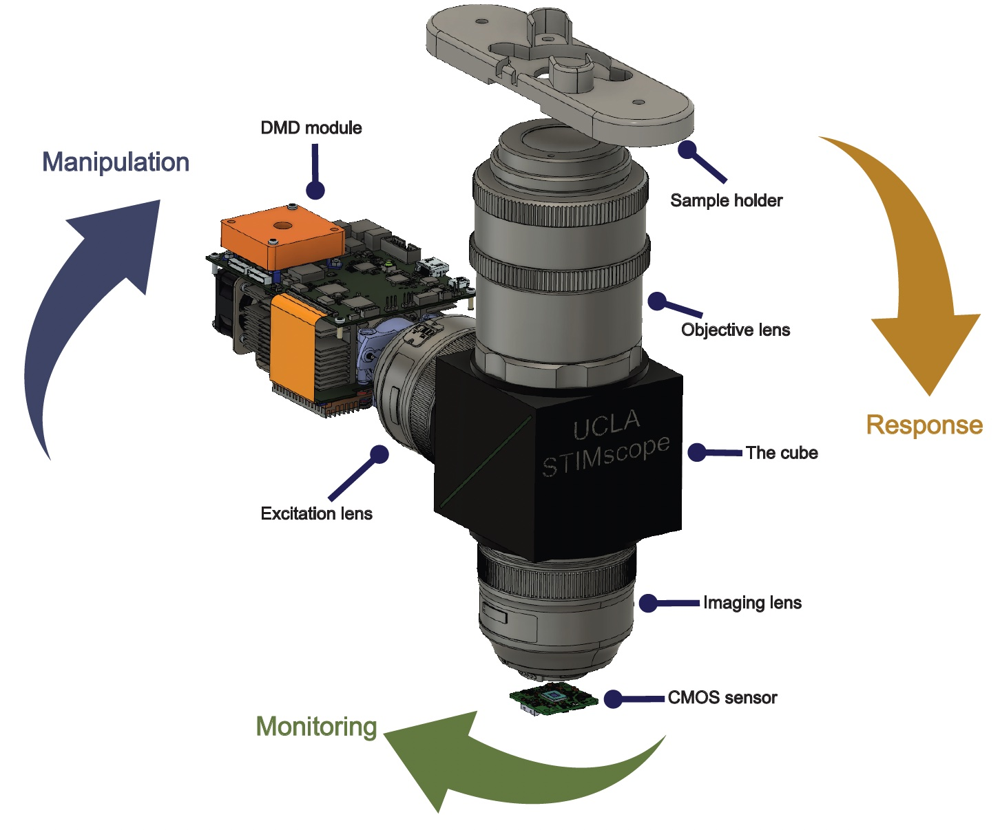

# STIMscope-public
**[[Miniscope V4 Wiki](https://github.com/Aharoni-Lab/Miniscope-v4/wiki)] [[Miniscope DAQ Software Wiki](https://github.com/Aharoni-Lab/Miniscope-DAQ-QT-Software/wiki)]  [[Miniscope-LFOV Wiki](https://github.com/Aharoni-Lab/Miniscope-LFOV/wiki)][[2021 Virtual Miniscope Workshop Recording](https://sites.google.com/metacell.us/miniscope-workshop-2021)]**

Open-source UCLA STIMscope project

  

