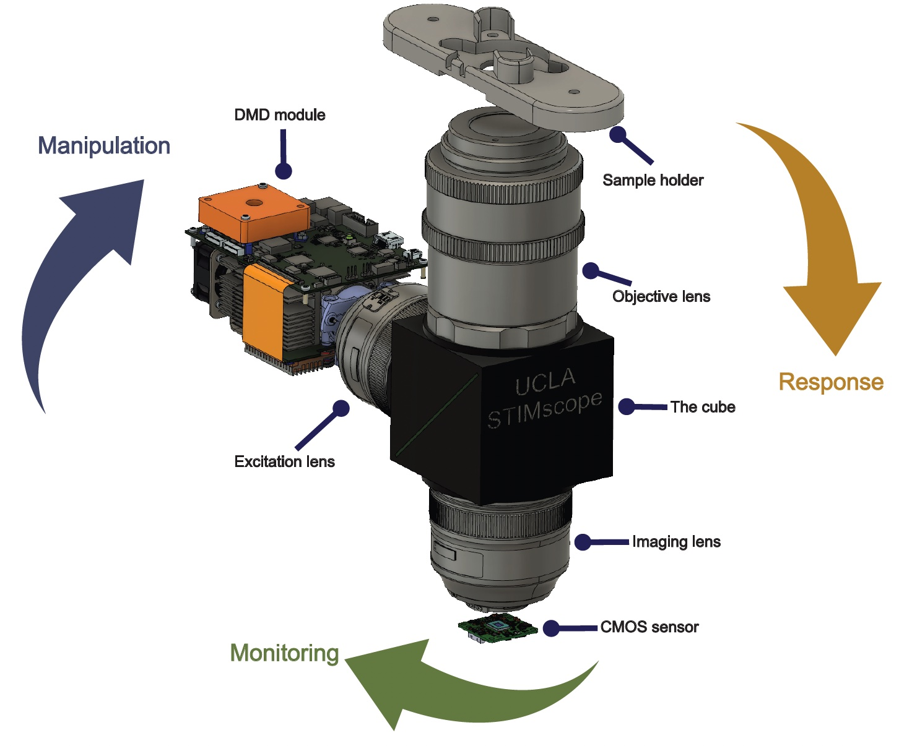

# STIMscope-public
**[[STIMscope Wiki](https://github.com/Aharoni-Lab/STIMscope-public/wiki)] [[STIMViewer Wiki](https://github.com/Aharoni-Lab/STIMscope-public/wiki/STIMViewer)] [[CRISPI Wiki](https://github.com/Aharoni-Lab/STIMscope-public/wiki/CRISPI)]**

Open-source UCLA STIMscope project

<p align="center">
  
</p>


> ⚠️ **Note:**
> Depending on your hardware and operating system, you **may not need all of the packages listed** below or may need to install specific versions (e.g., for GPU vs CPU).
> **Consult your system documentation to determine compatibility.**

---

## 📥 Download Instructions

1. **Create a Project Folder**

   ```bash
   mkdir STIMscope
   cd STIMscope
   ```

2. **Clone the CRISPI Branch**

   ```bash
   git clone -b CRISPI https://github.com/Aharoni-Lab/STIMscope-public.git
   cd STIMscope-public
   ```

---

## 🐍 Create and Activate a Virtual Environment

3. **Create the Virtual Environment**

   ```bash
   python3 -m venv venv
   ```

4. **Activate the Environment**

   * **macOS / Linux:**

     ```bash
     source venv/bin/activate
     ```
   * **Windows (PowerShell):**

     ```powershell
     venv\Scripts\Activate
     ```

---

## 📦 Install Required Packages

Below is a comprehensive list of dependencies you may need.
**Note:** Some packages are optional or hardware-dependent.

---

### ✅ Install Core Python Packages

Install core libraries:

```bash
pip install -r requirements.txt
```

For our specific hardware and software installations use the requirements-verbose.txt version instead.

---

### ✅ Install PyQt5

Recommended version (often most compatible):

```bash
pip install PyQt5==5.15.9
```

If you encounter issues, adjust the version accordingly.

---

### ✅ Install Napari

Napari is used for visualization:

```bash
pip install napari[all]
```

---

### ✅ Install TensorFlow (if needed)

For TensorFlow support, install either CPU or GPU version:

* **CPU:**

  ```bash
  pip install tensorflow
  ```
* **GPU (with CUDA):**

  ```bash
  pip install tensorflow-gpu
  ```

---

### ✅ Install Additional Dependencies (as needed)

Depending on your environment, you might also need:

* `PyOpenGL`
* `scikit-image`
* `matplotlib`
* `qtpy`
* `pillow`
* `dask`

Example:

```bash
pip install PyOpenGL scikit-image matplotlib qtpy pillow dask
```

---

### ✅ System Packages for Qt and OpenGL

If you are on **Linux**, install these system libraries:

```bash
sudo apt-get update
sudo apt-get install -y libgl1 libglib2.0-0 mesa-utils
```

---

## 🛠️ Fixing Common Issues

**Napari and PyQt5 Conflicts**

If you encounter errors related to `QtSvg` or `qtsvg`, you may need to **remove or comment out certain imports** to avoid conflicts.

> **Steps:**

1. Locate this file inside your virtual environment:

   ```
   venv/lib/python3.8/site-packages/qtpy/QtSvg.py
   ```
2. Open it in a text editor and **comment out or delete any imports** referencing `QtSvg`.
   This prevents compatibility issues with Napari.

---

**Other Known Fixes**

* **TensorFlow (tf):**
  Ensure correct CUDA/cuDNN versions if using GPU.
* **OpenCV:**
  Use `opencv-python-headless` to avoid GUI errors on headless systems.
* **libGL:**
  Install system libraries (`libgl1`, `mesa`).
* **mesa-utils:**
  Verify OpenGL installation.
* **PyQt5 Import Errors:**
  Reinstall specific versions or clean the environment.
* **QSvg / QtSvg:**
  Always check `QtSvg.py` if Napari fails to launch.

---

## ⚙️ Notes for Napari on Our Platform

When using Napari on our custom hardware/software environment, you **must**:

* Comment out the `QtSvg` imports in `qtpy`.
* Confirm `mesa` and `libGL` are installed.
* Test with:

  ```bash
  python -c "import napari"
  ```

  If this fails, re-check `PyQt5` and `QtSvg`.

---

## ✉️ Contact

For any questions or assistance, please contact us.
---

